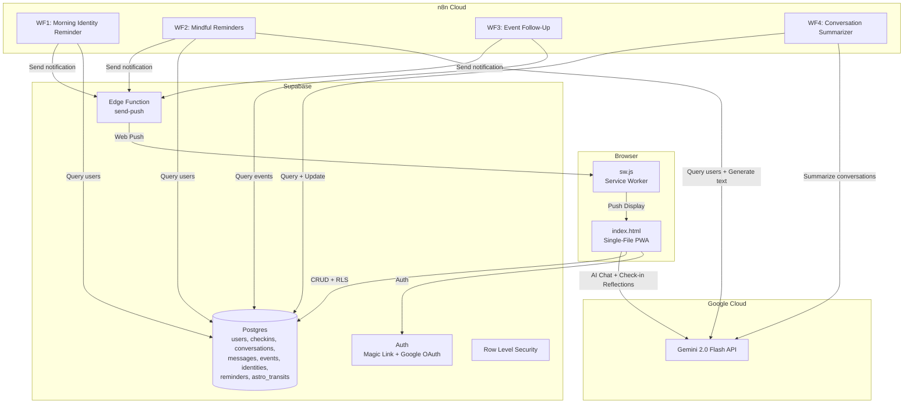

# MaiTribe

**Your holistic AI companion for body, mind and soul.**

MaiTribe is a Progressive Web App (PWA) that combines emotionally intelligent AI conversations, daily wellness check-ins, identity-based reflection, and mindful reminders into a single, calm experience. Mai is not a chatbot, coach, or therapist — she's a quiet, caring presence, like a thoughtful friend who truly sees you.

---

## Table of Contents

- [Features](#features)
- [Tech Stack](#tech-stack)
- [Architecture](#architecture)
- [File Structure](#file-structure)
- [Local Development](#local-development)
- [Environment Variables](#environment-variables)
- [n8n Workflow Setup](#n8n-workflow-setup)
- [Deployment](#deployment)
- [Phase Roadmap](#phase-roadmap)
- [License](#license)

---

## Features

- **Onboarding Journey** — Personalized setup capturing name, focus areas, and emotional baseline
- **Daily Check-ins** — Body, Mind, Soul, Energy sliders (1-10) with AI-generated reflections
- **AI Chat with Mai** — Context-aware conversations powered by Gemini 2.0 Flash
- **Identity Narratives** — AI-generated personal identity statements that evolve over time
- **Event Extraction** — Automatic detection of upcoming events from chat conversations
- **Push Notifications** — Morning identity reminders, mindful nudges, and event follow-ups
- **Bilingual** — Full English and German (primary) language support via i18n
- **Offline-First** — Service worker caching for offline access
- **Installable PWA** — Add to home screen on any device

---

## Tech Stack

| Layer | Technology |
|---|---|
| **Frontend** | Single `index.html` file (HTML + CSS + JS, no build step) |
| **Design** | Glassmorphism, Cormorant Garamond + DM Sans, sage/cream/gold palette |
| **Backend** | [Supabase](https://supabase.com) (Auth, Postgres, Edge Functions, RLS) |
| **AI** | [Gemini 2.0 Flash](https://ai.google.dev/) via REST API (fallback to Flash Lite on 429) |
| **Automation** | [n8n](https://n8n.io) (4 workflows for reminders, follow-ups, summaries) |
| **Push** | Web Push API + VAPID + Supabase Edge Function (`send-push`) |
| **Hosting** | Any static host (Vercel, Netlify, Cloudflare Pages) |

---

## Architecture



---

## File Structure

```
MaiTribe Codex/
├── index.html                          # Full app — all screens, styles, and logic
├── sw.js                               # Service worker (caching + push notifications)
├── manifest.webmanifest                # PWA manifest (installable config)
├── offline.html                        # Offline fallback page
├── icon.svg                            # App icon
├── landing.html                        # Marketing landing page
├── admin.html                          # Admin dashboard (user stats, internal use)
├── test-auth.html                      # Auth debugger (Supabase session testing)
├── CLAUDE.md                           # AI coding assistant instructions
│
├── supabase/
│   ├── schema.sql                      # Full database schema + RLS policies + auth trigger
│   ├── schema_update_workflows.sql     # Schema additions for n8n workflows
│   ├── schema_update_workflows.rollback.sql
│   ├── context_query.sql               # AI context query for prompt building
│   └── functions/
│       ├── send-push/
│       │   ├── index.ts                # Deno Edge Function for Web Push (VAPID)
│       │   └── .env.example            # VAPID key template
│       └── generate-identity/
│           ├── index.ts                # Deno Edge Function for identity generation
│           └── .env.example
│
├── n8n/
│   ├── IMPORT-CHECKLIST.md             # Setup guide for n8n workflows (DE)
│   └── workflows/
│       ├── workflow-1-morning-identity-reminder.json
│       ├── workflow-2-mindful-reminders.json
│       ├── workflow-3-event-followup.json
│       └── workflow-4-conversation-summarizer.json
│
└── docs/
    ├── database-schema-documentation.md    # DB schema reference
    ├── mai-system-prompt-documentation.md  # Mai personality + prompt docs
    ├── onboarding-flow-spec.md             # Onboarding flow specification
    ├── pitch-deck-outline.md               # Investor pitch deck (DE)
    ├── e2-visa-business-plan.md            # E-2 visa business plan
    ├── app-store-wrapper-spec.md           # TWA / Capacitor wrapper comparison
    ├── social-media-launch-posts.md        # Launch content templates
    ├── privacy-policy.md                   # Privacy policy
    └── terms-of-service.md                 # Terms of service
```

---

## Local Development

### Prerequisites

- A modern browser (Chrome/Edge/Safari/Firefox)
- Any static HTTP server (see options below)
- A [Supabase](https://supabase.com) project (free tier works)
- A [Google AI Studio](https://aistudio.google.com/) API key for Gemini

### 1. Clone or download the project

```bash
git clone <your-repo-url>
cd "MaiTribe Codex"
```

### 2. Set up Supabase

1. Create a new project at [supabase.com](https://supabase.com)
2. Open the **SQL Editor** and run `supabase/schema.sql`
3. Then run `supabase/schema_update_workflows.sql` for n8n workflow support
4. In **Authentication > Providers**, enable:
   - **Email** (Magic Link enabled)
   - **Google** (with OAuth credentials)
5. In **Authentication > URL Configuration**, add your local dev URL as a redirect URL (e.g., `http://localhost:3000`)

### 3. Get a Gemini API key

1. Go to [Google AI Studio](https://aistudio.google.com/)
2. Create an API key
3. For production, restrict the key to your deployment domain in Google Cloud Console

### 4. Serve locally

Pick any static server:

```bash
# Python
python3 -m http.server 3000

# Node.js (npx, no install needed)
npx serve -p 3000

# PHP
php -S localhost:3000
```

### 5. Configure the app

1. Open `http://localhost:3000` in your browser
2. Tap the gear icon to open **Project Keys**
3. Enter your keys:
   - `SUPABASE_URL` — your Supabase project URL
   - `SUPABASE_ANON_KEY` — your Supabase anon/public key
   - `GEMINI_API_KEY` — your Google AI Studio key
   - `VAPID_PUBLIC_KEY` — (optional) for push notification subscription

Keys are stored in `localStorage` and never leave the browser.

> **Note:** HTTPS is required for full PWA and push notification support. For local dev, `localhost` is exempt from this requirement.

---

## Environment Variables

### Client-side (entered in app UI)

| Key | Required | Description |
|---|---|---|
| `SUPABASE_URL` | Yes | Supabase project URL (`https://<ref>.supabase.co`) |
| `SUPABASE_ANON_KEY` | Yes | Supabase anonymous/public API key |
| `GEMINI_API_KEY` | Yes | Google AI Studio API key for Gemini 2.0 Flash |
| `VAPID_PUBLIC_KEY` | No | VAPID public key for push notification subscription |

### Supabase Edge Function (`send-push`)

| Key | Required | Description |
|---|---|---|
| `VAPID_PUBLIC_KEY` | Yes | VAPID public key |
| `VAPID_PRIVATE_KEY` | Yes | VAPID private key (keep secret) |
| `VAPID_SUBJECT` | Yes | `mailto:` contact for VAPID (`mailto:you@example.com`) |

### n8n Environment

| Key | Required | Description |
|---|---|---|
| `SUPABASE_URL` | Yes | Supabase project URL |
| `SUPABASE_SERVICE_ROLE_KEY` | Yes | Supabase service role key (server-side only) |
| `GEMINI_API_KEY` | Yes | Gemini API key for AI-generated reminders |
| `INTERNAL_WEBHOOK_SECRET` | Yes | Shared secret for WF3 event follow-up webhook |

### n8n Postgres Credential

| Field | Value |
|---|---|
| Host | `db.<project-ref>.supabase.co` |
| Port | `5432` |
| Database | `postgres` |
| User | `postgres` |
| Password | Your Supabase DB password |
| SSL | `require` |

---

## n8n Workflow Setup

MaiTribe uses four n8n workflows for background automation:

| # | Workflow | Purpose | Schedule |
|---|---|---|---|
| 1 | Morning Identity Reminder | Sends personalized identity reminder via push | Every 5 min (checks user time) |
| 2 | Mindful Reminders | Generates + sends AI-crafted mindfulness nudges | Every 10 min (checks user time) |
| 3 | Event Follow-Up | Sends follow-up after user's extracted events | Webhook-triggered |
| 4 | Conversation Summarizer | Summarizes inactive conversations (topics, mood) | Every 10 min |

### Import order

1. Import workflows from `n8n/workflows/` in order (WF1 through WF4)
2. Set n8n environment variables (see above)
3. Map the Postgres credential to all Postgres nodes
4. Deploy the `send-push` Edge Function on Supabase
5. Activate in order: WF4, WF1, WF2, WF3

See [`n8n/IMPORT-CHECKLIST.md`](n8n/IMPORT-CHECKLIST.md) for the full step-by-step guide.

---

## Deployment

### Static Hosting (Vercel / Netlify / Cloudflare Pages)

MaiTribe is a static site — no server-side rendering or build step required.

**Vercel:**
```bash
# Install Vercel CLI
npm i -g vercel

# Deploy from project root
vercel --prod
```

**Netlify:**
1. Connect your Git repo at [netlify.com](https://netlify.com)
2. Set publish directory to `/` (project root)
3. No build command needed

**Cloudflare Pages:**
1. Connect your Git repo in the Cloudflare dashboard
2. Set output directory to `/` (project root)
3. No build command needed

### Supabase

1. Your Supabase project handles auth, database, and edge functions
2. Deploy the push notification edge function:
   ```bash
   supabase functions deploy send-push
   ```
3. Set VAPID secrets in the Supabase dashboard under **Edge Functions > send-push > Secrets**

### n8n

- **n8n Cloud** (recommended): Import workflows via the n8n UI, set environment variables, activate
- **Self-hosted n8n**: Same process, ensure the instance can reach Supabase and Gemini APIs

### Production Checklist

- [ ] Restrict Gemini API key to your deployment domain in Google Cloud Console
- [ ] Configure Supabase auth redirect URLs for your production domain
- [ ] Deploy `send-push` edge function with VAPID secrets
- [ ] Import and activate all 4 n8n workflows
- [ ] Set up custom domain with HTTPS (required for PWA + push)
- [ ] Test magic link login, Google OAuth, check-ins, chat, and push notifications

---

## Phase Roadmap

### Phase 1 — MVP (Current)

The foundation: a complete AI wellness companion with core daily-use features.

- Daily check-ins (body, mind, soul, energy) with AI reflections
- AI chat with Mai (context-aware, personality-driven)
- Identity narrative generation and morning reminders
- Event extraction from conversations + follow-up reminders
- Mindful reminder system (AI-generated, push-delivered)
- Conversation summarization (topics, mood, summary)
- Bilingual support (English + German)
- Magic link + Google OAuth authentication
- Offline-capable PWA with push notifications
- 324 waitlist users for early validation

### Phase 2 — Astrology + Human Design

Deeper personalization through energetic and archetypal profile systems.

- Birth data collection (date, time, city) during onboarding
- Natal chart calculation and sun/moon/rising sign display
- Daily astrological transit insights integrated into check-ins
- Human Design type, profile, authority, and strategy
- HD daily gate tracking and descriptions
- Astro + HD context woven into Mai's AI responses
- Premium subscription tier gating for advanced modules

### Phase 3 — B2B Corporate Wellness

Scaling beyond individual users into team and enterprise wellbeing.

- Team/organization accounts with admin dashboards
- Aggregated (anonymized) team wellness metrics
- Corporate wellness program packages and pilot framework
- Manager insights for burnout prevention and team health
- Custom onboarding flows for enterprise rollout
- Coach and facilitator tools (white-label potential)
- B2B pricing tiers and annual contract structure

---

## License

All rights reserved. This is a proprietary project.
