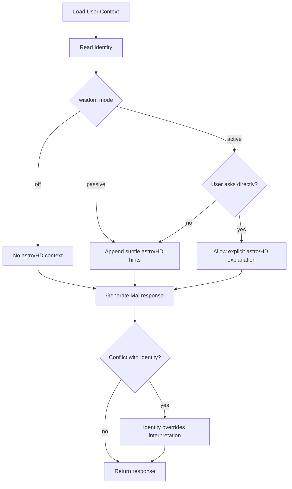

# Astro & Human Design Integration Concept (Phase 2-3)

## Purpose
Define how astrology and Human Design can be integrated into MaiTribe without breaking the product core: identity-first emotional support.

## Core Principle: Three Knowledge Layers

1. `Layer 1: Identity` (always on, user-authored)
- Source: onboarding + identity editing
- Example: "Ich bin jemand, der auch an schweren Tagen freundlich mit sich bleibt."
- Priority: highest

2. `Layer 2: Astrology` (optional, opt-in)
- Source: birth date/time/place + computed natal/transit data
- Usage: subtle framing and timing awareness
- Priority: below identity

3. `Layer 3: Human Design` (optional, opt-in)
- Source: birth date/time/place + HD profile computation
- Usage: decision style, energy rhythm, interaction style
- Priority: below identity, same level as astrology

## Design Principles

### 1) Invisible Intelligence
- Mai should not mention astrology or Human Design by default.
- If enabled, insights are used as background context only.
- Explicit naming only when user asks directly (for example: "Was sagen die Transite?").

### 2) Identity Dominance
- If chart interpretation conflicts with active identity, identity wins.
- Prompt rule: "Follow user agency and chosen identity over deterministic interpretations."

### 3) Consent-Driven Wisdom
- Default state: OFF.
- User chooses one of three modes:
  - `off`: no astro/HD usage
  - `passive`: used internally, never explicitly named
  - `active`: user can request explicit astro/HD interpretation

### 4) Pull, Not Push
- Create dedicated area: `Dein Spiegel`
- User actively requests astrological/HD insights there.
- No unsolicited "cosmic alerts" on home/chat by default.

## Product Surfaces

### Chat with Mai
- Passive mode: subtle phrasing only.
- Active mode: explicit astro/HD framing allowed on request.

### Check-in Reflection
- Use astro/HD only to tune tone/intensity (never deterministic statements).

### Dein Spiegel
- New tab/screen with explicit cards:
  - "Heute im Spiegel" (daily)
  - "Dein Geburtsspiegel" (natal baseline)
  - "Entscheidungs-Kompass" (HD strategy/authority)

## Data Model Extensions

Add fields to `public.users`:

```sql
alter table public.users
  add column if not exists astro_profile jsonb,
  add column if not exists human_design jsonb,
  add column if not exists wisdom_preferences jsonb;
```

Suggested JSON shapes:

```json
{
  "astro_profile": {
    "birth_date": "1990-08-01",
    "birth_time": "07:15",
    "birth_place": "Berlin, DE",
    "lat": 52.52,
    "lng": 13.405,
    "natal_chart": {}
  },
  "human_design": {
    "type": "Generator",
    "strategy": "Wait to respond",
    "authority": "Sacral",
    "profile": "2/4",
    "centers": {
      "defined": [],
      "undefined": []
    }
  },
  "wisdom_preferences": {
    "astro_enabled": false,
    "hd_enabled": false,
    "mode": "off"
  }
}
```

## Prompt Injection Strategy

When building system context:

1. Always append identity context.
2. Append astro/HD context only when `wisdom_preferences.mode != "off"`.
3. Add explicit instruction:

```text
Use astrology and Human Design context subtly.
Do not mention astrology or Human Design by name unless the user explicitly asks.
If there is any conflict, follow the user's active identity and present choice.
Avoid deterministic or fatalistic language.
```

## Decision Logic (Runtime)



## Privacy & Safety

- Birth data and chart objects are sensitive personal data.
- Store only required chart outputs, not raw external provider payloads if avoidable.
- Add explicit consent capture + revocation path.
- "Delete astro/HD data" action should hard-delete `astro_profile` + `human_design`.
- No sharing to third parties beyond configured compute provider.

## Phase Plan

## Phase 2: Astrology Foundation
- Add astro profile input in onboarding/settings.
- Compute natal chart server-side (Edge Function or service).
- Store daily transit summary.
- Passive integration into prompt context.
- Add "Dein Spiegel" read-only astro section.

## Phase 3: Human Design + Active Mode
- Add HD computation from birth data.
- Store type/strategy/authority/profile/centers.
- Extend "Dein Spiegel" with HD insights.
- Add active mode prompts ("Was sagen die Transite?", "Was sagt mein Design?").
- Add advanced guardrails against deterministic outputs.

## Technical Milestones

1. Schema migration for 3 new JSONB fields.
2. Edge Functions:
- `compute-astro-profile`
- `compute-human-design`
- `daily-transit-refresh`
3. Prompt composer update with mode gating.
4. UI:
- Settings consent controls
- `Dein Spiegel` section
5. QA:
- mode off/passive/active behavior
- identity precedence tests
- language consistency tests

## Success Criteria

- Identity-first behavior preserved in all responses.
- No explicit astro/HD mentions in passive mode.
- Users can opt out instantly and delete data.
- `Dein Spiegel` enables explicit exploration without polluting core chat flow.
