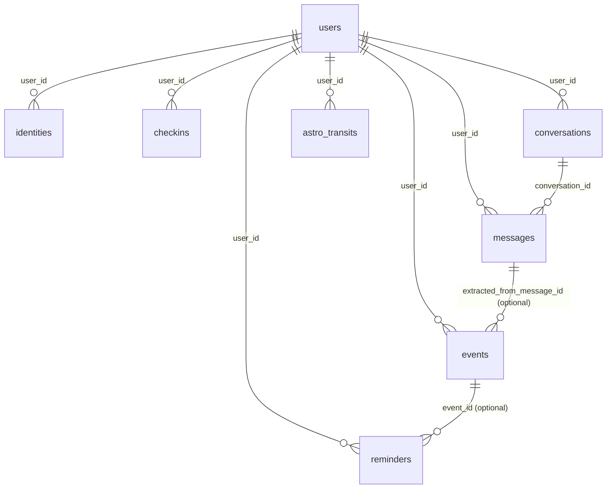

# MaiTribe Database Schema Documentation

Last updated: 2026-02-21  
Primary target schema: `supabase/schema.sql` + `supabase/schema_update_workflows.sql` + `supabase/schema_audit_migration.sql`

## 1) Scope
This documentation describes all required MaiTribe tables:
- `public.users`
- `public.checkins`
- `public.identities`
- `public.conversations`
- `public.messages`
- `public.events`
- `public.reminders`
- `public.waitlist`
- `public.astro_transits`

## 2) Migration History
| Order | File | Purpose |
|---|---|---|
| 1 | `supabase/schema.sql` | Baseline app schema (core user/chat/check-in/event/reminder/transit model). |
| 2 | `supabase/schema_update_workflows.sql` | Adds workflow-driven fields (reminder toggles, follow-up metadata, identity sentence fields, topics/mood). |
| 3 | `supabase/schema_update_workflows.rollback.sql` | Rollback for workflow-specific additions. |
| 4 | `supabase/schema_audit_migration.sql` | Comprehensive reconciliation migration: verifies required tables, adds missing columns, enforces RLS policy set, and creates performance indexes. |

## 3) Mermaid ER Diagram

## 4) Table Documentation

## `public.users`
Description: Main user profile and settings table linked to Supabase Auth.

Primary key:
- `id uuid` (FK to `auth.users.id`)

Foreign keys:
- `id -> auth.users(id)` ON DELETE CASCADE

Columns:
| Column | Type | Constraints / Default | Description |
|---|---|---|---|
| id | uuid | PK | User ID (same as auth user). |
| email | text |  | Email address. |
| name | text |  | Name field (legacy/general). |
| display_name | text |  | Preferred display name. |
| avatar_url | text |  | Avatar URL. |
| language | text | default `'en'`, check set | UI language. |
| timezone | text | default `'UTC'` | IANA timezone. |
| theme | text | default `'dark'`, check set | UI theme. |
| subscription_tier | text | default `'free'`, check set | Plan tier. |
| subscription_started_at | timestamptz |  | Subscription start. |
| subscription_expires_at | timestamptz |  | Subscription end. |
| onboarding_completed | boolean | default `false` | Onboarding status. |
| onboarding_step | integer | default `0` | Last completed onboarding step. |
| birth_date | date |  | Optional birth date. |
| birth_time | time |  | Optional birth time. |
| birth_time_known | boolean | default `false` | Birth time confidence flag. |
| birth_city | text |  | Optional birthplace city. |
| birth_country | text |  | Optional birthplace country. |
| birth_latitude | decimal(10,7) |  | Optional geo latitude. |
| birth_longitude | decimal(10,7) |  | Optional geo longitude. |
| astrology_enabled | boolean | default `false` | Astro features on/off. |
| human_design_enabled | boolean | default `false` | Human Design features on/off. |
| hd_type | text |  | Human Design type. |
| hd_profile | text |  | Human Design profile. |
| hd_authority | text |  | Human Design authority. |
| hd_strategy | text |  | Human Design strategy. |
| sun_sign | text |  | User sun sign. |
| moon_sign | text |  | User moon sign. |
| rising_sign | text |  | User rising sign. |
| mc_sign | text |  | Midheaven sign. |
| natal_chart_json | jsonb |  | Stored natal chart payload. |
| morning_reminder_time | time | default `'07:00'` | Daily morning reminder time. |
| morning_reminder_enabled | boolean | default `true` | Morning reminder toggle. |
| mindful_reminders_enabled | boolean | default `true` | Mindful reminders toggle. |
| mindful_reminder_count | integer | default `3`, check `0..5` | Daily mindful reminders count. |
| event_followup_enabled | boolean | default `true` | Event follow-up toggle. |
| push_token | text |  | Web Push subscription JSON string. |
| created_at | timestamptz | default `now()` | Creation timestamp. |
| updated_at | timestamptz | default `now()` | Updated by trigger. |
| last_active_at | timestamptz | default `now()` | Last seen timestamp. |

RLS policies:
- `users_select_own`
- `users_insert_own`
- `users_update_own`
- `users_delete_own`

Indexes:
- `idx_users_last_active` on `(last_active_at desc)`
- `idx_users_language` on `(language)`
- `idx_users_subscription` on `(subscription_tier)` (baseline schema)

---

## `public.checkins`
Description: Periodic wellness scores (Body/Mind/Soul/Energy) plus optional note and AI response.

Primary key:
- `id uuid` default `gen_random_uuid()`

Foreign keys:
- `user_id -> public.users(id)` ON DELETE CASCADE

Columns:
| Column | Type | Constraints / Default | Description |
|---|---|---|---|
| id | uuid | PK, default `gen_random_uuid()` | Check-in ID. |
| user_id | uuid | not null | Owner user ID. |
| body | integer | check `1..10` | Body score. |
| mind | integer | check `1..10` | Mind score. |
| soul | integer | check `1..10` | Soul score. |
| energy | integer | check `1..10` | Energy score. |
| note | text | nullable | Optional free-text check-in note. |
| mai_response | text | nullable | AI-generated reflection for this check-in. |
| created_at | timestamptz | default `now()` | Creation timestamp. |

RLS policies:
- `checkins_select_own`
- `checkins_insert_own`
- `checkins_update_own`
- `checkins_delete_own`

Indexes:
- `idx_checkins_user_date` on `(user_id, created_at desc)`

---

## `public.identities`
Description: Versioned identity texts used in onboarding and reminder rotation.

Primary key:
- `id uuid` default `gen_random_uuid()`

Foreign keys:
- `user_id -> public.users(id)` ON DELETE CASCADE

Columns:
| Column | Type | Constraints / Default | Description |
|---|---|---|---|
| id | uuid | PK, default `gen_random_uuid()` | Identity row ID. |
| user_id | uuid | not null | Owner user ID. |
| full_text | text | not null | Full identity paragraph. |
| one_liner | text | nullable | First/short identity sentence. |
| sentences | jsonb | nullable | Identity split into sentence array. |
| language | text | default `'en'` | Identity language code. |
| is_active | boolean | default `true` | Active identity flag. |
| version | integer | default `1` | Incrementing identity version. |
| created_at | timestamptz | default `now()` | Creation timestamp. |
| updated_at | timestamptz | default `now()` | Updated by trigger. |

RLS policies:
- `identities_select_own`
- `identities_insert_own`
- `identities_update_own`
- `identities_delete_own`

Indexes:
- `idx_identities_user_active` on `(user_id, is_active)`
- `idx_identities_user_active_created` on `(user_id, is_active, created_at desc)`

---

## `public.conversations`
Description: Conversation sessions, lifecycle state, summary metadata, extracted topics/mood.

Primary key:
- `id uuid` default `gen_random_uuid()`

Foreign keys:
- `user_id -> public.users(id)` ON DELETE CASCADE

Columns:
| Column | Type | Constraints / Default | Description |
|---|---|---|---|
| id | uuid | PK, default `gen_random_uuid()` | Conversation ID. |
| user_id | uuid | not null | Owner user ID. |
| title | text | nullable | Optional title. |
| summary | text | nullable | AI summary text. |
| topics | jsonb | default `[]` | Extracted topics list. |
| mood | text | nullable | Derived mood label. |
| is_active | boolean | default `true` | Active conversation flag. |
| created_at | timestamptz | default `now()` | Creation timestamp. |
| updated_at | timestamptz | default `now()` | Updated by trigger. |
| ended_at | timestamptz | nullable | Conversation ended timestamp. |

RLS policies:
- `conversations_select_own`
- `conversations_insert_own`
- `conversations_update_own`
- `conversations_delete_own`

Indexes:
- `idx_conversations_user` on `(user_id, created_at desc)`
- `idx_conversations_active` on `(user_id, is_active)`
- `idx_conversations_user_created` on `(user_id, created_at desc)`
- `idx_conversations_user_active` on `(user_id, is_active)`
- `idx_conversations_user_updated` on `(user_id, updated_at desc)`

---

## `public.messages`
Description: Message-level records linked to conversations and users.

Primary key:
- `id uuid` default `gen_random_uuid()`

Foreign keys:
- `conversation_id -> public.conversations(id)` ON DELETE CASCADE
- `user_id -> public.users(id)` ON DELETE CASCADE

Columns:
| Column | Type | Constraints / Default | Description |
|---|---|---|---|
| id | uuid | PK, default `gen_random_uuid()` | Message ID. |
| conversation_id | uuid | not null | Parent conversation. |
| user_id | uuid | not null | Owner user ID. |
| role | text | check (`user`,`assistant`) | Message role. |
| content | text | not null | Message content. |
| input_type | text | default `text`, check set | Input modality (`text`,`voice`). |
| created_at | timestamptz | default `now()` | Creation timestamp. |

RLS policies:
- `messages_select_own`
- `messages_insert_own`
- `messages_update_own`
- `messages_delete_own`

Note: policies enforce both `auth.uid() = user_id` and ownership of parent `conversation_id`.

Indexes:
- `idx_messages_conversation` on `(conversation_id, created_at asc)`
- `idx_messages_user` on `(user_id, created_at desc)`
- `idx_messages_conversation_date` on `(conversation_id, created_at asc)`
- `idx_messages_user_date` on `(user_id, created_at desc)`

---

## `public.events`
Description: User events extracted from chat/manual input with pre-reminder and follow-up lifecycle fields.

Primary key:
- `id uuid` default `gen_random_uuid()`

Foreign keys:
- `user_id -> public.users(id)` ON DELETE CASCADE
- `extracted_from_message_id -> public.messages(id)` (nullable)

Columns:
| Column | Type | Constraints / Default | Description |
|---|---|---|---|
| id | uuid | PK, default `gen_random_uuid()` | Event ID. |
| user_id | uuid | not null | Owner user ID. |
| title | text | not null | Event title. |
| description | text | nullable | Event details. |
| event_time | timestamptz | nullable | Event datetime. |
| source | text | default `chat`, check set | Origin (`chat`,`manual`,`calendar`). |
| extracted_from_message_id | uuid | FK nullable | Source message reference. |
| pre_reminder_sent | boolean | default `false` | Pre-reminder sent flag. |
| pre_reminder_time | timestamptz | nullable | Pre-reminder timestamp. |
| followup_sent | boolean | default `false` | Follow-up sent flag. |
| followup_time | timestamptz | nullable | Follow-up timestamp. |
| followup_response | text | nullable | Follow-up message payload. |
| status | text | default `upcoming`, check set | Status (`upcoming`,`completed`,`cancelled`). |
| created_at | timestamptz | default `now()` | Creation timestamp. |

RLS policies:
- `events_select_own`
- `events_insert_own`
- `events_update_own`
- `events_delete_own`

Indexes:
- `idx_events_user_upcoming` on `(user_id, event_time asc)` where `status='upcoming'`
- `idx_events_user_event_time` on `(user_id, event_time asc)`
- `idx_events_followup_due` on `(event_time)` where `followup_sent=false and status in ('upcoming','completed')`

---

## `public.reminders`
Description: Scheduled reminder queue and delivery log for morning identity, mindful reminders, and event reminders.

Primary key:
- `id uuid` default `gen_random_uuid()`

Foreign keys:
- `user_id -> public.users(id)` ON DELETE CASCADE
- `event_id -> public.events(id)` (nullable)

Columns:
| Column | Type | Constraints / Default | Description |
|---|---|---|---|
| id | uuid | PK, default `gen_random_uuid()` | Reminder ID. |
| user_id | uuid | not null | Owner user ID. |
| type | text | check set | Reminder type. |
| content | text | not null | Reminder text body. |
| variation_type | text | nullable | A/B or template variation marker. |
| scheduled_for | timestamptz | not null | Planned send time. |
| sent | boolean | default `false` | Sent state. |
| sent_at | timestamptz | nullable | Actual send timestamp. |
| delivery_method | text | default `push`, check set | Delivery channel. |
| event_id | uuid | FK nullable | Optional event link. |
| created_at | timestamptz | default `now()` | Creation timestamp. |

RLS policies:
- `reminders_select_own`
- `reminders_insert_own`
- `reminders_update_own`
- `reminders_delete_own`

Indexes:
- `idx_reminders_pending` on `(scheduled_for asc)` where `sent=false`
- `idx_reminders_user` on `(user_id, scheduled_for desc)`
- `idx_reminders_user_date` on `(user_id, scheduled_for desc)`
- `idx_reminders_event_id` on `(event_id)`

---

## `public.waitlist`
Description: Landing-page waitlist signups.

Primary key:
- `id uuid` default `gen_random_uuid()`

Foreign keys:
- `user_id -> auth.users(id)` ON DELETE SET NULL (optional; authenticated attribution)

Columns:
| Column | Type | Constraints / Default | Description |
|---|---|---|---|
| id | uuid | PK, default `gen_random_uuid()` | Waitlist row ID. |
| email | text | unique, not null | Signup email. |
| name | text | nullable | Optional name. |
| source | text | default `landing` | Signup source/campaign marker. |
| user_id | uuid | FK nullable | Optional auth user link. |
| created_at | timestamptz | default `now()` | Signup timestamp. |

RLS policies:
- `waitlist_insert_public` (public insert for landing form)
- `waitlist_select_own` (authenticated users can read own rows only)
- `waitlist_update_own` (authenticated users can update own rows only)
- `Service role manages waitlist`

Indexes:
- `waitlist_email_key` (table unique constraint)
- `idx_waitlist_email_lower` on `(lower(email))`
- `idx_waitlist_created_at` on `(created_at desc)`

---

## `public.astro_transits`
Description: Per-user daily astrology/Human Design transit insight cache.

Primary key:
- `id uuid` default `gen_random_uuid()`

Foreign keys:
- `user_id -> public.users(id)` ON DELETE CASCADE

Columns:
| Column | Type | Constraints / Default | Description |
|---|---|---|---|
| id | uuid | PK, default `gen_random_uuid()` | Transit row ID. |
| user_id | uuid | not null | Owner user ID. |
| transit_date | date | not null | Day represented by this transit. |
| daily_insight | text | nullable | Daily interpretation text. |
| hd_daily_gate | text | nullable | Human Design gate of the day. |
| hd_gate_description | text | nullable | Gate interpretation text. |
| sun_sign | text | nullable | Transit sun sign. |
| moon_sign | text | nullable | Transit moon sign. |
| rising_sign | text | nullable | Transit rising sign. |
| raw_data | jsonb | nullable | Raw provider payload. |
| created_at | timestamptz | default `now()` | Creation timestamp. |

Backward compatibility field (older installs):
- `transits jsonb` may exist and can be retained as legacy field.

Uniqueness:
- unique pair `(user_id, transit_date)`

RLS policies:
- `Users read own transits`
- `astro_transits_insert_own`
- `astro_transits_update_own`
- `astro_transits_delete_own`
- `Service role manages transits`

Indexes:
- `idx_astro_user_date_unique` unique on `(user_id, transit_date)`
- `idx_astro_user_date` on `(user_id, transit_date desc)`

## 5) RLS Summary
| Table | RLS Enabled | Owner-scoped read/write |
|---|---|---|
| users | yes | yes |
| checkins | yes | yes |
| identities | yes | yes |
| conversations | yes | yes |
| messages | yes | yes (plus parent-conversation ownership check) |
| events | yes | yes |
| reminders | yes | yes |
| waitlist | yes | partial (public insert; owner read/update; service-role full) |
| astro_transits | yes | yes (plus service-role full) |

## 6) Notes for Engineering
- App code uses `checkins` (not `check_ins`).
- `waitlist` is consumed by `landing.html` via client-side Supabase insert.
- `push_token` stores serialized Web Push subscription JSON in `users`.
- `reminders` is intended to be populated by n8n and/or backend jobs.
