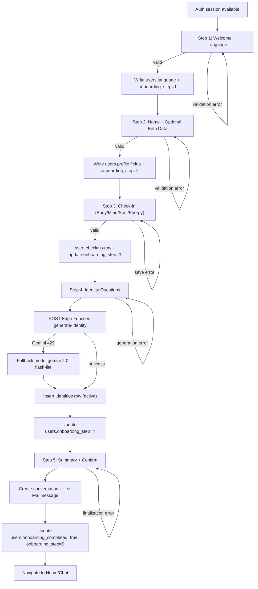

# MaiTribe Onboarding Flow Specification

Last updated: 2026-02-21
Status: Validated against Codex Parallel Tasks briefing
Scope: Full onboarding flow for MaiTribe PWA, including validation, persistence, i18n, and failure handling.

## 1. Flow Overview
The onboarding flow has 5 steps:
1. Welcome + Language selection
2. Name + optional birth data
3. Initial check-in (4 sliders)
4. Identity generation (4 questions)
5. Summary + first message from Mai

Primary goals:
- Personalize user experience early.
- Persist progress safely after each step.
- Generate first high-quality identity and emotional context.
- Hand off into chat/home state with low friction.

## 2. Preconditions and Dependencies
- User is authenticated (Supabase Auth session exists).
- `public.users` row exists for `auth.uid()`.
- `SUPABASE_URL`, `SUPABASE_ANON_KEY`, and `GEMINI_API_KEY` are configured.
- For Step 4 generation, use Edge Function `generate-identity`.

## 3. Data Model Touchpoints
Primary tables touched during onboarding:
- `public.users`
- `public.checkins`
- `public.identities`
- `public.conversations`
- `public.messages`

Relevant user fields:
- `display_name`, `language`, `timezone`
- `birth_date`, `birth_time`, `birth_city`, `birth_country`
- `onboarding_step`, `onboarding_completed`, `last_active_at`

## 4. Mermaid Flowchart

## 5. Step-by-Step Specification

## Step 1: Welcome + Language
### UI Description
- Headline and short brand promise.
- Language selector visible on the same step.
- CTA: continue.

### Validation
- `language` required.
- Must be one of supported codes: `en`, `de`, `es`, `fr`, `pt`, `it`, `nl`.

### Database Writes
- `public.users.update` by `id = userId`:
- `language`
- `onboarding_step = 1`
- `last_active_at = now()`

### Error Cases
- Invalid language code -> inline validation error, block step transition.
- Supabase write timeout/error -> keep user on step, show retry CTA.

### i18n Keys
Existing keys used:
- `onboard_welcome_title`
- `onboard_welcome_text`
- `onboard_begin`
- `onboard_language_label`
- `onboard_continue`

Suggested new keys:
- `status_invalid_language`
- `status_failed_save_step1`

## Step 2: Name + Birth Data (Optional)
### UI Description
- Required name input.
- Optional birth inputs:
- `birth_date`
- `birth_time`
- `birth_city`
- `birth_country`
- CTA: continue.

### Validation
- `display_name` required, trimmed, min 2 chars, max 60 chars.
- Birth fields optional.
- If `birth_time` is filled, `birth_date` should also be present.
- If one location field is filled, require both city and country for consistency.

### Database Writes
- `public.users.update`:
- `display_name`
- `name` (same as display_name for MVP)
- `birth_date` (nullable)
- `birth_time` (nullable)
- `birth_city` (nullable)
- `birth_country` (nullable)
- `onboarding_step = 2`
- `last_active_at = now()`

### Error Cases
- Name missing/too short -> inline error.
- Partial invalid birth data -> inline error with correction hint.
- Supabase write error -> remain on step, allow retry.

### i18n Keys
Existing keys used:
- `onboard_name_label`
- `onboard_continue`

Suggested new keys:
- `onboard_birthdate_label`
- `onboard_birthtime_label`
- `onboard_birthcity_label`
- `onboard_birthcountry_label`
- `onboard_birth_optional_hint`
- `status_name_required`
- `status_invalid_birth_data`
- `status_failed_save_step2`

## Step 3: Check-in with 4 Sliders
### UI Description
- Four sliders: Body, Mind, Soul, Energy (1..10).
- Optional free-text note.
- CTA for reflection generation and CTA to continue.

### Validation
- All four slider values required and constrained to integer 1..10.
- Note optional, max length recommended (e.g., 2000 chars).

### Database Writes
- Insert into `public.checkins`:
- `user_id`
- `body`, `mind`, `soul`, `energy`
- `note`
- `created_at` auto
- Update `public.users`:
- `onboarding_step = 3`
- `last_active_at = now()`

### Error Cases
- Slider out of range -> client-side clamp + validation warning.
- Check-in insert fails -> show error, keep values in UI/local state.
- AI reflection fails -> save check-in anyway, show non-blocking fallback reflection.

### i18n Keys
Existing keys used:
- `onboard_checkin_title`
- `onboard_checkin_sub`
- `slider_body`
- `slider_mind`
- `slider_soul`
- `slider_energy`
- `onboard_checkin_note_label`
- `onboard_checkin_note_placeholder`
- `onboard_checkin_btn`

Suggested new keys:
- `status_invalid_checkin_values`
- `status_failed_save_checkin`
- `status_checkin_saved`

## Step 4: Identity (4 Questions)
### UI Description
- Sequential 4-question experience.
- One answer field at a time.
- Final generation action calls backend Edge Function.
- Display generated identity in editable textarea.

### Validation
- Exactly 4 answers required.
- Each answer non-empty (recommended min 8 chars).
- Generation action disabled until all answers valid.

### Database Writes
- Backend function `generate-identity` executes:
- Read user context (`display_name`, `language`, recent check-ins).
- Call Gemini `gemini-2.0-flash` with Mai prompt style.
- On 429 fallback to `gemini-2.0-flash-lite`.
- Deactivate previous active identity (`is_active=false`).
- Insert new active identity in `public.identities`:
- `user_id`, `full_text`, `one_liner`, `sentences`, `language`, `version`, `is_active=true`
- Update `public.users.onboarding_step = 4`, `last_active_at = now()`.

### Error Cases
- Function returns 400 for malformed answers -> show field-level errors.
- Gemini timeout/rate limits -> fallback model, then deterministic local fallback text.
- Identity insert fails -> keep generated text client-side and provide retry.

### i18n Keys
Existing keys used:
- `onboard_identity_title`
- `onboard_identity_sub`
- `identity_q1`
- `identity_q2`
- `identity_q3`
- `identity_q4`
- `identity_save_answer`
- `identity_generate`
- `identity_generating`
- `onboard_identity_generated_label`
- `identity_accept`
- `identity_skip`

Suggested new keys:
- `status_invalid_identity_answers`
- `status_generation_retry`
- `status_failed_save_identity`

## Step 5: Summary + First Message from Mai
### UI Description
- Summary card with:
- Name and language
- Birth data presence indicator (if provided)
- Latest check-in snapshot
- Identity one-liner preview
- Final CTA: finish onboarding.
- After finish, immediately show first personalized message from Mai.

### Validation
- Identity must exist (generated or manually edited).
- Step completion blocked if required final data missing.

### Database Writes
On finish:
- Update `public.users`:
- `onboarding_completed = true`
- `onboarding_step = 5`
- `last_active_at = now()`

Then create first conversation context:
- Insert `public.conversations` row:
- `user_id`, `is_active=true`, optional `title='Getting started with Mai'`
- Insert first assistant row in `public.messages`:
- `conversation_id`, `user_id`, `role='assistant'`, `content=<opening message>`, `input_type='text'`

### Error Cases
- Final user update fails -> do not navigate, show retry.
- Conversation/message insert fails -> complete onboarding anyway, open home with recovery retry for chat init.
- AI opening message fails -> use localized fallback opening text.

### i18n Keys
Existing keys used:
- `onboard_reminders_title`
- `onboard_ready`
- `home_today`
- `home_identity_label`
- `chat_fallback_opening`

Suggested new keys:
- `onboard_summary_title`
- `onboard_summary_profile`
- `onboard_summary_checkin`
- `onboard_summary_identity`
- `status_failed_finalize_onboarding`
- `status_failed_create_first_message`

## 6. Global Error Handling Rules
- Never lose user input on network errors; keep local step state in memory/local storage until successful write.
- Use retry with backoff for transient failures (especially AI calls).
- Separate blocking errors from non-blocking errors.
- Always return localized user-facing messages via i18n keys.

## 7. i18n Implementation Notes
- All visible text must be key-based via `t(key)`.
- Add missing step keys before UI rollout.
- Keep parity between English and German key sets.
- Use consistent status key naming: `status_*`.

## 8. Acceptance Criteria
- User can complete all 5 steps without data loss.
- Each step writes expected DB data and updates `onboarding_step`.
- Step 4 reliably generates and persists identity with fallback behavior.
- Step 5 always ends with `onboarding_completed=true` and a first Mai message (AI or fallback).
- Full flow is localizable and fully translatable via i18n keys.
